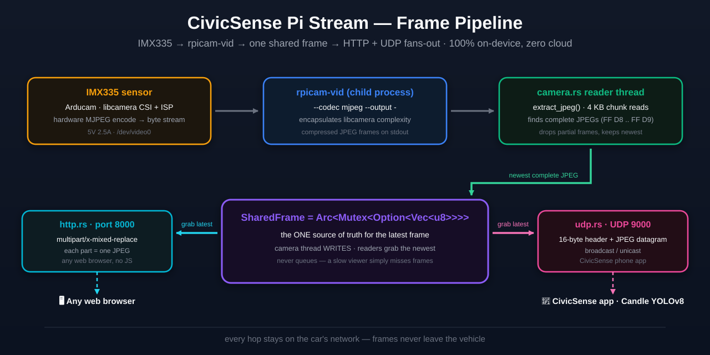

# 🎥 CivicSense Pi Stream: MJPEG + UDP Video Streaming Server in Rust

> A tiny, fast, privacy-first **live dash-cam streaming server** that turns a **Raspberry Pi Zero 2 W** with an **Arducam IMX335** camera into a real-time video source your phone can stream straight from, with no cloud, no router, and no SDK lock-in. Built in **100% Rust**, it shells out to `rpicam-vid` and ships **three focused binaries** so you deploy exactly what you need.

---

## ✨ Why this project exists (and why it's built this way)

**The problem.** You want a camera you can plug into your car and watch live from your phone. Off-the-shelf dash-cams force you into their vendor app, their cloud, or their closed ecosystem. The CivicSense philosophy is **edge-native and privacy-first**: all capture, perception, and decision-making happen on-device, and **zero video ever leaves the car**.

**What this repo contributes.** It is the *capture* layer of the CivicSense stack. It takes the hardest engineering constraint - a 512 MB Raspberry Pi with a single-core-friendly, lowest-cost ARMv7 CPU - and makes it do one thing extremely well: **get camera frames off the sensor and onto a viewer with the least latency and the least overhead possible.**

**Why Rust and not Python/OpenCV?** On a Pi Zero 2 W every megabyte and every millisecond counts.

- **Memory** - an in-kernel, dependency-free Rust binary idles around **~50 MB**, leaving the other ~450 MB free for the YOLOv8 detection client running alongside it.
- **Startup** - Rust starts in milliseconds; Python + OpenCV + NumPy takes many seconds to import and spins up several hundred MB.
- **No runtime baggage** - one static binary, no interpreter, no site-packages, nothing to version-skew.
- **Determinism** - Rust's ownership model means the camera reader thread and the streaming threads share frames without data races, and it compiles to a single artifact you can audit.

**Why "shell out" to `rpicam-vid` instead of reading the camera directly?** The Arducam IMX335 is driven by libcamera, and `rpicam-vid` is the reference (and heavily tested) application that already handles sensor init, ISP, and MJPEG encoding. Re-using it means this project tracks upstream camera fixes for free, instead of re-implementing half a camera stack. We consume its compressed stream over stdout and focus our code on *distribution* (HTTP + UDP), not capture plumbing.

---

## 🚦 Part of the CivicSense ecosystem

[](https://github.com/arpanpathak/driving-civicsense-vision-model)
[](https://github.com/arpanpathak/civicsense-stream-client)

CivicSense is a growing family of privacy-first, edge-native AI tools for road civility. **All data collection & inference stay on-device - zero video leaves the car.**

| Repo | Role in the pipeline |
|---|---|
| **CivicSense (this repo)** | 🎥 *Produces* the live camera stream (HTTP + UDP) |
| **[Stream Client](https://github.com/arpanpathak/civicsense-stream-client)** | 🧠 *Perceives* objects on-device (YOLOv8n via Candle, pure-Rust ML) by consuming this MJPEG stream |
| **[Main CivicSense repo](https://github.com/arpanpathak/driving-civicsense-vision-model)** | 🚦 *Consumes* insights for intersection discipline, lane courtesy, hazard alerts & cooperative safety |

**Data flow:** produce (this repo) -> perceive (stream client) -> consume (main repo). Every stage stays inside the car.

---

## 🧭 Table of Contents

1. [What's Inside](#whats-inside)
2. [Quick Start](#quick-start)
3. [Hardware You Need](#hardware-you-need)
4. [Flash the OS and First Boot](#flash-the-os-and-first-boot)
5. [Camera Configuration](#camera-configuration)
6. [Build and Run the Streamer](#build-and-run-the-streamer)
7. [Then, Stream to Your Phone](#then-stream-to-your-phone)
8. [How It Works Under the Hood](#how-it-works-under-the-hood)
9. [Docker Cross-Compilation](#docker-cross-compilation)
10. [UDP Streaming Protocol for the Phone App](#udp-streaming-protocol-for-the-phone-app)
11. [WiFi Hotspot Mode (plug into the car, no router)](#wifi-hotspot-mode-plug-into-the-car-no-router)
12. [Run Automatically at Boot (systemd)](#run-automatically-at-boot-systemd)
13. [Project Layout](#project-layout)
14. [Configuration Reference](#configuration-reference)
15. [Troubleshooting](#troubleshooting)
16. [Credits](#credits)
17. [License](#license)

[](LICENSE)
[](https://www.rust-lang.org)
[](https://www.raspberrypi.com/)
[](https://www.arducam.com/)
[](https://github.com/arpanpathak/civicsense-pi-stream/releases)
[](Dockerfile)

---

## 📦 What's Inside

| Component | Detail |
|---|---|
| Camera | Arducam 5MP IMX335 low-light camera (M12 lens, 15-15 and 15-22 pin cables) |
| Board | Raspberry Pi Zero 2 W (any single-board you like, really) |
| OS | Raspberry Pi OS 32-bit (Raspbian); also builds for 64-bit |
| Streaming | MJPEG over HTTP (`multipart/x-mixed-replace`) **and** raw MJPEG over UDP datagrams |
| Performance | ~15 FPS at 640x480, ~50 MB RAM, ~40-60% CPU on a Pi Zero 2 W |
| Language | 100% Rust, zero Python, zero OpenCV |

### The three binaries

Because the CLI world is divided into "browser viewers" and "app viewers," the project ships one library and **three binaries**. They share all camera/capture code; only the delivery differs.

| Binary | Delivery | What it's for |
|---|---|---|
| `pi_stream_http` | HTTP `multipart/x-mixed-replace` | Watching in any **web browser** at `http://<pi-ip>:8000`. MJPEG's killer feature is that a plain `` tag renders it with zero plugins. |
| `pi_stream_udp` | Raw MJPEG **UDP datagrams** | Feeding a **phone app** at UDP port 9000. UDP is far lighter for the device than a TCP connection per viewer, and it's naturally broadcast-friendly over a hotspot. |
| `pi_stream` | **Both** HTTP + UDP | The **all-in-one** binary for car hotspot mode, where you want one camera feeding both a browser (for testing) and the phone app simultaneously. |

> **Why keep three binaries instead of one with flags?** "Do one thing well." The separate `pi_stream_udp` / `pi_stream_http` build tiny, fast, single-purpose artifacts - handy when you only need one transport. The all-in-one exists for the realistic hotspot case. All three are produced by a single `cargo build`.

---

## 🚀 Quick Start

The absolute fastest way to get binaries on a Pi (or any Linux box) is Docker:

```bash
make build                 # cross-compiles for armv7, aarch64, x86_64 into ./bin
sudo ./scripts/install.sh  # installs the all-in-one binary + systemd unit
```

Then watch it live:

```bash
sudo systemctl start pi_stream            # starts HTTP :8000 + UDP :9000
open http://<pi-ip>:8000                   # browser - you should see video
```

Read on for the full, platform-neutral walkthrough.

---

## 🔧 Hardware You Need

| Item | Why / notes |
|---|---|
| Raspberry Pi Zero 2 W | Our reference board: 512 MB RAM, ARMv7, ~$15 |
| Arducam IMX335 module | 5MP, low-light 1/2.8" sensor, M12 lens. Higher sensitivity than the stock Pi camera for nighttime roads |
| 5V 2.5A micro-USB power | The Pi's camera pipeline spikes; a weak supply causes camera resets |
| microSD card (≥ 8 GB) | OS + project |
| A computer to flash the SD card | **Any OS** - see below, we don't care what you use |

> **Board freedom.** This project isn't glued to the Zero 2 W. Both supported ARM targets (32-bit and 64-bit) cover the whole Pi family - Pi 2, 3, 4, 5 - and `x86_64` lets you run the same code on a VM or dev box. Change camera settings via env vars (`PI_STREAM_WIDTH`, `PI_STREAM_HEIGHT`) - see [Configuration Reference](#configuration-reference).

---

## 💾 Flash the OS and First Boot

This section deliberately stays **OS-neutral**: you flash an SD card with Raspberry Pi OS, and the tool for that - the official **Raspberry Pi Imager** - runs on Windows, macOS, and Linux alike. There is nothing Mac-specific here.

### 0. Generate an SSH keypair (do this BEFORE you flash)

SSH is how you will log in to the headless Pi, and the cleanest way to authenticate is a **keypair** instead of a password. You generate the keypair **once, on your own machine**; the *private* half stays with you, and the *public* half gets baked into the SD card image so the Pi trusts you from the very first boot.

Open a terminal (macOS/Linux: any terminal; Windows 10+ and 11: PowerShell or Terminal, which ship OpenSSH built-in) and run:

```bash
ssh-keygen -t ed25519 -a 100 -C "your_email@example.com"
```

Press Enter to accept the default location (`~/.ssh/id_ed25519`), and set a passphrase (strongly recommended - it encrypts the private key on disk, so a stolen laptop file alone is not enough to impersonate you).

This creates two files:

| File | What it is | Rule |
|---|---|---|
| `~/.ssh/id_ed25519` | Your **private** key | NEVER share, upload, or commit this |
| `~/.ssh/id_ed25519.pub` | Your **public** key | Safe to share; this is what you paste into Imager |

What the flags mean:

- `-t ed25519` - the key algorithm (see "SSH cryptography in detail" below for why Ed25519 and how it relates to RSA).
- `-a 100` - 100 rounds of the key-derivation function that stretches your passphrase. Higher means slower to brute-force the private key if it is ever stolen.
- `-C "comment"` - a human label (usually your email) so you can tell keys apart.

View your public key - this exact text is what goes into Imager's "Authorized keys" field:

```bash
cat ~/.ssh/id_ed25519.pub
```

> **Why this must happen BEFORE flashing:** Imager's pre-config writes your public key into the Pi's `~/.ssh/authorized_keys` during first boot. Generate the key afterward and you would need a keyboard + monitor attached to the Pi, or a second boot, to get in. Keys first, then flash.

### 1. Get Raspberry Pi Imager

Download the official **Raspberry Pi Imager** from [raspberrypi.com/software](https://www.raspberrypi.com/software/). It ships installers for Windows, macOS, and Ubuntu/Debian. Install it on whatever machine you have.

### 2. Choose the OS image

In Imager, pick an OS:

- **Raspberry Pi OS (32-bit)** - *recommended* if you want the smallest, best-tested footprint (this is what our reference runs).
- **Raspberry Pi OS (64-bit)** - use if you prefer 64-bit userland; our Docker build covers it too (`aarch64`).
- **Raspberry Pi OS Lite** - no desktop, smaller and leaner, ideal if you only ever SSH in.

Pick the variant that matches how you want to operate the device.

### 3. Pre-configure (headless, no monitor needed)

Click the gear icon in Imager to preset your network so the Pi can be reached with zero keyboard/monitor:

| Setting | Recommended value | Why |
|---|---|---|
| Hostname | `civicsense` | A stable name beats remembering an IP |
| Enable SSH | Public-key only | Secure, no password over the wire |
| Authorized keys | Paste your public key | So you can SSH in without a password |
| Username | `pi` (or any user) | `pi` is default on Pi OS |
| WiFi SSID/password | Your home/workshop network | Lets the Pi join your LAN for setup |
| Country | Your country | Correct WiFi regulatory domain |

> **Why pre-configure?** The Pi Zero 2 W has no HDMI-friendly GPU for a desktop by default, and most people deploy it headless. Pre-seeding these fields means the first boot is SSH-able directly. If you *do* have a monitor+keyboard, skip this and configure interactively.

### 4. Write the image and boot

Imager flashes the SD card. Insert it, power the Pi, wait ~1-2 minutes for first boot.

### 5. Connect over SSH

Find the Pi's address on your router's DHCP list, or discover it with `arp -a` / `ping civicsense`. Then:

```bash
ssh pi@civicsense          # or ssh <user>@<ip>
```

First connect may ask to trust the host key (a normal ECDSA fingerprint warning).

> **SSH keys are portable.** A public key is just text; the same one works whether you generated it on Windows (PowerShell/OpenSSH or PuTTYgen), macOS, or Linux. The steps in [step 0](#0-generate-an-ssh-keypair-do-this-before-you-flash) are identical everywhere - there is no OS-specific ceremony.

---

### SSH cryptography in detail: what is actually happening

"RSA", "Diffie-Hellman" and "keys" get thrown around loosely, but an SSH connection actually runs a four-phase handshake, and each phase uses a *different* kind of math. Here is the honest, end-to-end picture.

**Two different jobs, two different math families.**

| Job | Math | Modern SSH default |
|---|---|---|
| Agree on a secret session key (secrecy) | Diffie-Hellman (DH), elliptic-curve variant ECDH/X25519 | X25519 |
| Prove identity (authentication) | Signatures: RSA, Ed25519, ECDSA | Ed25519 (host key + user key) |
| Bulk encryption of the session | Symmetric cipher | AES-GCM / ChaCha20-Poly1305 |

A classic confusion: **RSA is NOT key exchange.** RSA is an asymmetric cipher that SSH uses to *sign* (prove identity). Key *exchange* is a separate job done by Diffie-Hellman (or its elliptic-curve form). And Ed25519 - which this guide's `ssh-keygen -t ed25519` creates - is a modern signature scheme that replaces RSA for SSH keys: 32-byte keys (vs 256+ bytes for RSA-2048), faster, and considered stronger per byte.

**RSA, in detail.** Pick two large primes `p` and `q`, compute `n = p * q` and `phi = (p-1) * (q-1)`. Choose a public exponent `e` (usually 65537) and compute the private exponent `d` so that `e * d = 1 (mod phi)`. The public key is `(n, e)`; the private key is `(n, d)`. Everything runs as modular exponentiation: `c = m^e mod n` to encrypt, `m = c^d mod n` to decrypt, and `s = hash^d mod n` to sign (verification checks `s^e mod n == hash`). It is secure because factoring `n` back into `p` and `q` is computationally infeasible at 2048 bits and larger. In SSH, your private key never leaves your machine: the Pi sends a random challenge, your client signs it with `d`, and the Pi verifies the signature with the public key you baked into `authorized_keys`.

**Diffie-Hellman key exchange, in detail.** Both sides agree on public values `(p, g)`. You pick a secret `a` and send `A = g^a mod p`; the Pi picks a secret `b` and sends `B = g^b mod p`. You compute `K = B^a mod p`, the Pi computes `K = A^b mod p` - both arrive at the SAME `K = g^(a*b) mod p` - yet an eavesdropper who only saw `A` and `B` cannot recover `K` without solving the discrete-logarithm problem, which is intractable for large `p`. Modern SSH uses the elliptic-curve version (X25519 / Curve25519) of the same idea: faster, smaller numbers, same security story.

**Why "forward secrecy" matters.** The DH keys are *ephemeral* - fresh ones every connection. So even if someone later steals the Pi's long-term host key or your private key, they still cannot decrypt *recorded* past sessions, because each session's key existed only for that session. That is exactly why SSH does key exchange (DH) at all, instead of simply encrypting with the public key: DH is what buys you forward secrecy.

**The four phases of an SSH connection.**

1. **TCP connect** to the Pi on port 22.
2. **Key exchange (DH/ECDH/X25519).** Client and Pi compute a shared, ephemeral symmetric session key. Everything after this point is encrypted.
3. **Server authentication (host key).** The Pi signs the handshake transcript with its *host key* (RSA or Ed25519). Your client verifies the signature against `~/.ssh/known_hosts`. This is the only defense against a man-in-the-middle (MITM) - the fingerprint warning you see on first connect is exactly this step. Verify the fingerprint out-of-band, then accept.
4. **Client authentication (your key).** The Pi sends a challenge; your client signs it with your private key; the Pi verifies against the public key in `authorized_keys`. Your private key never crossed the wire.
5. **Data.** All remaining traffic (including your shell) flows through the tunnel, encrypted with the session key using a symmetric cipher (AES-GCM or ChaCha20-Poly1305).

**Why public-key auth beats passwords.**

- A password is delivered inside the encrypted tunnel, but the Pi holds its hash, and any machine that can reach port 22 can try to brute-force it.
- With a key, there is nothing to steal by guessing: an attacker without your private key cannot pass the signature challenge. Combine this with `PasswordAuthentication no` in `/etc/ssh/sshd_config` and the Pi's SSH port becomes practically uninteresting to brute-forcers.

---

## 📷 Camera Configuration

The Arducam IMX335 needs its own libcamera packages (the stock Pi camera driver won't enumerate it). These steps run **on the Pi**.

### 1. Install the Arducam libcamera packages

```bash
wget -O install_pivariety_pkgs.sh \
  https://github.com/ArduCAM/Arducam-Pivariety-V4L2-Driver/releases/download/install_script/install_pivariety_pkgs.sh
chmod +x install_pivariety_pkgs.sh
./install_pivariety_pkgs.sh -p libcamera_dev
./install_pivariety_pkgs.sh -p libcamera_apps
```

This fetches Arducam's fork of libcamera plus the `rpicam-*` apps (which include `rpicam-vid`, our capture engine).

### 2. Tell the Pi to use the IMX335 sensor

```bash
sudo nano /boot/firmware/config.txt   # older Pi OS: /boot/config.txt
```

Add/ensure these lines:

```text
camera_auto_detect=0
dtoverlay=imx335
```

- `camera_auto_detect=0` - disables the stock "look for the Raspberry Pi camera" probing.
- `dtoverlay=imx335` - loads the device tree overlay that describes the Arducam IMX335 to the kernel.

Save, then reboot:

```bash
sudo reboot
```

### 3. Verify the sensor

```bash
rpicam-hello --list-cameras
```

You should see the IMX335, e.g.:

```text
0 : imx335 [2624x1944 12-bit RGGB] ...
```

If it appears here, capture is ready.

> **Why 2624x1944 max but we stream 640x480?** The IMX335's *raw sensor resolution* is 2624x1944, but we ask `rpicam-vid` to *scale down and encode* to MJPEG at 640x480. That's the sweet spot: plenty clear for a dash-cam feed, but computationally cheap enough that a Pi Zero 2 W sustains ~15 FPS at 40-60% CPU, leaving headroom for the detection client. Raise it via `PI_STREAM_WIDTH`/`PI_STREAM_HEIGHT` if you have power to spare.

---

## ⚙️ Build and Run the Streamer

### Option A - Build on the Pi (simple, no Docker needed)

Install Rust if needed:

```bash
curl --proto '=https' --tlsv1.2 -sSf https://sh.rustup.rs | sh
source ~/.cargo/env
```

Copy this repo to the Pi (from any machine - `scp`, a USB stick, `git clone`):

```bash
git clone <this-repo-url> ~/pi_stream     # or scp / copy the folder over
cd ~/pi_stream
cargo build --release
```

All three binaries land in `target/release/`. Run whichever you need:

```bash
./target/release/pi_stream_http   # browser streaming   -> :8000
./target/release/pi_stream_udp    # phone-app streaming -> :9000
./target/release/pi_stream        # both, all-in-one
```

Expected output:

```text
🌐 HTTP MJPEG streaming on http://0.0.0.0:8000
📡 UDP MJPEG streaming on port 9000 (broadcast: true)
```

### Option B - Cross-compile with Docker (faster, reproducible)

Building natively on the Pi is slow, and hand-rolled cross-compiling is a notorious source of "it worked on my laptop" bugs. The Dockerized build fixes both - see [Docker Cross-Compilation](#docker-cross-compilation). It produces `./bin/<triple>/` binaries you copy over and run with no toolchain on the Pi.

---

## 📱 Then, Stream to Your Phone

**Over a browser:** `http://<pi-ip>:8000` in any phone/web browser. No app needed.

**To a native phone app via UDP:** run `pi_stream_udp` (or `pi_stream`), open your CivicSense phone app, and it will receive datagrams on **UDP 9000**. With *broadcast mode* on (the default), the phone doesn't even need to know the Pi's IP - it just listens. See the full [wire protocol](#udp-streaming-protocol-for-the-phone-app) in section 10.

---

## 🔍 How It Works Under the Hood

Understanding the pipeline demystifies the design and helps you debug:

<p align="center">
   rpicam-vid -> camera.rs -> SharedFrame -> HTTP + UDP fan-out" width="900"/>
</p>

**Why `rpicam-vid` at all?** It encapsulates all the libcamera complexity (CSI sensor init, ISP tuning, encoding). We just give it `--codec mjpeg --output -` and read its stdout - cheap, robust, and forward-compatible.

**Why a shared latest-frame store instead of a per-viewer buffer?** The store keeps exactly the *newest complete JPEG*. Each viewer simply grabs the latest and sends it. If a viewer is slow, it misses frames (rather than queueing and falling behind), which is the correct behavior for live video: **always show the freshest frame, never accumulate delay.**

**HTTP path.** `http.rs` replies `multipart/x-mixed-replace`. A browser sees `Content-Type` parts, each containing one JPEG; the browser *replaces* the previous image on the `` with each new part. No JavaScript needed.

**UDP path.** `udp.rs` snaps the latest frame into a UDP datagram (with a 16-byte header). Because UDP has no per-connection state on the server, *any number of phones* can listen on the same broadcast, and the sender cost doesn't scale with viewers. See [section 10](#udp-streaming-protocol-for-the-phone-app).

---

## 🐳 Docker Cross-Compilation

**Why Docker for building?** Cross-compiling for ARM on a laptop is finicky: you need the right linker, the right `glibc` headers, and they must match the exact *target* distro or you get segfaults. This project freezes all of that inside a container, so **the build is byte-for-byte reproducible on any machine** - the "dockerized approach" removes whole classes of "but it built on my machine" bugs.

One `make build` produces binaries for every supported target:

| Target triple | Runs on |
|---|---|
| `armv7-unknown-linux-gnueabihf` | Pi Zero 2 W / Pi 2 / Pi 3 - **32-bit** Raspberry Pi OS |
| `aarch64-unknown-linux-gnu` | Pi 3 / Pi 4 / Pi 5 / Zero 2 W - **64-bit** Raspberry Pi OS |
| `x86_64-unknown-linux-gnu` | dev machines / CI (not for the Pi, for testing) |

> **Why these triples?** The trailing `-gnueabihf` / `-gnu` encodes the C ABI. 32-bit Raspberry Pi OS uses hard-float EABI (`gnueabihf`); 64-bit uses the standard GNU ABI (`gnu`). We target both so any Pi OS you've flashed is covered, and `x86_64` catches dev escaping.

### Quick start

```bash
make build
```

Binaries land in `bin/<target-triple>/`:

```
bin/
├── armv7-unknown-linux-gnueabihf/pi_stream
├── armv7-unknown-linux-gnueabihf/pi_stream_http
├── armv7-unknown-linux-gnueabihf/pi_stream_udp
├── aarch64-unknown-linux-gnu/...
└── x86_64-unknown-linux-gnu/...
```

Build just one target: `make build TARGETS="aarch64-unknown-linux-gnu"`.

No buildx? Use `make build-legacy` (plain `docker build` + `docker cp`).

> **Why the binaries are glibc-compatible:** the container is Debian Bookworm, the same libc generation Raspberry Pi OS uses. Linking inside it produces binaries that run on the Pi's glibc without version mismatches - that's what eliminates the historical "segfault because I cross-compiled" failures.

---

## 📡 UDP Streaming Protocol for the Phone App

`pi_stream_udp` (and `pi_stream`) sends the live camera as raw MJPEG UDP datagrams. **UDP was chosen because** it's connectionless (the server holds no per-phone state), broadcast-natively (one packet hits every listener), and has the lowest possible latency for dropping-in-frame-of-sight video - if a datagram is lost, you simply miss one frame; the *next* frame is fresh. For live video, freshness beats reliability.

### Wire format (16-byte header, little-endian integers)

| offset | size | field | meaning |
|---|---|---|---|
| 0 | 4 | magic | `0x50 0x49 0x53 0x54` ("PIST") |
| 4 | 4 | sequence | per-frame counter (wraps at u32::MAX) |
| 8 | 2 | fragment | 0-based index of this datagram within the frame |
| 10 | 2 | total | datagrams that make up this frame (1 = whole) |
| 12 | 4 | length | JPEG payload bytes in *this* datagram |
| 16 | .. | payload | JPEG fragment |

- **Why a header at all?** A raw JPEG byte-stream over UDP is ambiguous (where does one frame end and the next begin?). The 16-byte header makes each packet self-describing: a receiver can validate magic, order frames by `sequence`, and know exactly how to reassemble.
- **Fragmentation.** IPv4 UDP payloads cap at 65507 bytes (`65535 − 20 IP − 8 UDP`). A 640x480 JPEG is smaller, but a higher-res frame isn't. So a frame larger than `65507 − 16` is split: each chunk becomes a datagram carrying the same `sequence` and its `fragment`/`total` index. The app buffers until `fragment + 1 == total`, then reassembles.
- **Little-endian** is the convention modern CPUs and phones read natively, so the app parses without byte-swapping.

### Discovery ("connect")

The app sends the 4-byte control packet `PING` to `<pi-ip>:<port>`. The Pi replies `PONG` and - when broadcast mode is **off** - begins unicasting frames to that address.

**When broadcast is on (the default):** the Pi sends every frame to `255.255.255.255:<port>`, which is received by *any* phone on the same subnet. This is the magic of hotspot mode: **the phone app doesn't need to know the Pi's IP at all - it just listens.** Discovery via `PING/PONG` exists for when broadcast is off, or when the phone is on a different subnet and needs explicit unicast.

### Configuration

| Variable | Default | Meaning |
|---|---|---|
| `PI_STREAM_UDP_PORT` | 9000 | UDP port |
| `PI_STREAM_UDP_BROADCAST` | 1 | send to 255.255.255.255 |
| `PI_STREAM_UDP_FPS` | 15 | UDP send rate |
| `PI_STREAM_UDP_TARGETS` | (none) | extra unicast `ip[:port]` list |

---

## 📶 WiFi Hotspot Mode (plug into the car, no router)

**The vision:** plug the Pi into the car's USB-A port. It draws power from the port and **becomes its own access point**. The phone joins that network and streams - no router, no internet, no infrastructure. This is CivicSense in its most self-contained form.

**Why this matters for the phone:** over a hotspot, the Pi *is* the network authority. It hands out IPs (DHCP), and with UDP broadcast mode the phone just listens - the classic two-device "couple two radios" problem is solved with zero phone configuration.

Two scripts are provided because Raspberry Pi OS history splits into two network stacks. Pick the one matching your OS:

| Script | When to use | Under the hood |
|---|---|---|
| `scripts/hotspot-nmcli.sh` | Raspberry Pi OS (desktop or Lite) **since Bookworm**, which ships NetworkManager by default | `nmcli device wifi hotspot` - one command, managed by NetworkManager |
| `scripts/hotspot-hostapd.sh` | classic hostapd + dnsmasq setups (older Lite, or NetworkManager disabled) | Configures `hostapd` (radio) + `dnsmasq` (DHCP) manually |

Both bring up SSID `CivicSense` (password `civicsense123`, override with `PI_STREAM_SSID` / `PI_STREAM_PASSWORD`) and make the Pi an access point:

```bash
sudo ./scripts/hotspot-nmcli.sh          # or hotspot-hostapd.sh
sudo systemctl enable --now pi_stream    # all-in-one: HTTP :8000 + UDP :9000
```

Then the phone connects to `CivicSense`, opens the app, and receives MJPEG datagrams on UDP 9000.

> **"nmcli" vs "hostapd" - what's the difference?** NetworkManager is a service that manages your network interfaces from user space, and `nmcli` is its command-line client; it can turn your WiFi card into an access point with a single command. `hostapd + dnsmasq` is the lower-level, classic approach: `hostapd` puts the WiFi chip into AP mode directly, and `dnsmasq` runs the DHCP server for connected phones. NetworkManager is the modern, simpler choice; `hostapd` is the fallback that works when NetworkManager isn't present.

---

## 🔄 Run Automatically at Boot (systemd)

**What is systemd?** It's the init system that runs on essentially every modern Linux (including Raspberry Pi OS). A *unit file* tells it what to start, when, and how to restart it if it crashes.

The repo ships a ready unit at `deploy/pi_stream.service`, and an installer that lays everything down:

```bash
sudo ./scripts/install.sh
```

That copies the three binaries to `/usr/local/bin`, installs the unit, and enables autostart. To install manually:

```bash
sudo cp deploy/pi_stream.service /etc/systemd/system/pi_stream.service
sudo systemctl daemon-reload
sudo systemctl enable --now pi_stream
```

- `daemon-reload` - tell systemd you added/edited a unit.
- `enable` - start on every boot.
- `--now` - also start it immediately.

The unit runs the all-in-one `pi_stream` (HTTP + UDP) and restarts it if it ever dies:

```bash
sudo systemctl status pi_stream    # live status
journalctl -u pi_stream -f          # live logs
```

---

## 🗂 Project Layout

```
pi_stream/
├── src/
│   ├── lib.rs               # library crate root (exported modules)
│   ├── config.rs            # env-var configuration shared by all binaries
│   ├── frame.rs             # shared latest-frame store + JPEG demuxer
│   ├── camera.rs            # rpicam-vid subprocess wrapper
│   ├── http.rs              # HTTP MJPEG server (multipart/x-mixed-replace)
│   ├── udp.rs               # UDP MJPEG datagram sender + PING discovery
│   └── bin/
│       ├── pi_stream.rs     # all-in-one: HTTP + UDP (hotspot mode)
│       ├── pi_stream_http.rs# HTTP-only server (original behavior)
│       └── pi_stream_udp.rs # UDP-only streamer (phone app)
├── bin/                     # cross-compiled artifacts (gitignored)
├── scripts/
│   ├── hotspot-nmcli.sh     # NetworkManager hotspot
│   ├── hotspot-hostapd.sh   # hostapd + dnsmasq hotspot
│   └── install.sh           # install binaries + systemd unit
├── deploy/pi_stream.service # systemd unit
├── Dockerfile               # multi-arch cross-compile builder
├── Makefile                 # make build -> ./bin
└── .cargo/config.toml       # cross-linkers for armv7 / aarch64
```

**Why a library + three thin binaries?** All the logic lives in `src/*.rs` (the library). Each `src/bin/*.rs` is a ~30-line entry point that wires the right modules together. This gives you three executables with **zero code duplication** - the exact same capture/HTTP/UDP code powers all of them.

---

## ⚙️ Configuration Reference

No config file to manage. Everything is read from environment variables, so one systemd `Environment=` block or a shell one-liner suffices:

| Variable | Default | Used by | Meaning |
|---|---|---|---|
| `PI_STREAM_CAMERA_BIN` | `rpicam-vid` | all | Path to the capture binary |
| `PI_STREAM_WIDTH` | 640 | all | Capture width |
| `PI_STREAM_HEIGHT` | 480 | all | Capture height |
| `PI_STREAM_FRAMERATE` | 15 | all | Capture FPS |
| `PI_STREAM_HTTP_PORT` | 8000 | http/all-in-one | HTTP MJPEG port |
| `PI_STREAM_UDP_PORT` | 9000 | udp/all-in-one | UDP stream port |
| `PI_STREAM_UDP_BROADCAST` | 1 | udp/all-in-one | Broadcast to 255.255.255.255 |
| `PI_STREAM_UDP_FPS` | 15 | udp/all-in-one | UDP send rate |
| `PI_STREAM_UDP_TARGETS` | (none) | udp/all-in-one | Extra unicast `ip[:port]` list |

Example - lower resolution and boost framerate, no recompile:

```bash
PI_STREAM_WIDTH=800 PI_STREAM_HEIGHT=600 PI_STREAM_FRAMERATE=24 ./target/release/pi_stream
```

**Why env vars and not a TOML/YAML config file?** On an embedded Pi, the config *is* the process's environment (systemd, containers, and shell scripts all set env vars natively). It means zero config-file parsing code, no schema to version, and the same knobs work identically whether you run the binary directly, under systemd, or inside Docker. Ask: *"Would a config file add value here?"* - for a handful of knobs, no.

---

## 🩺 Troubleshooting

| Problem | Likely cause / fix |
|---|---|
| `rpicam-hello: command not found` | Missing libcamera apps: `sudo apt install rpicam-apps`, or run the Arducam installer again |
| `supply ovdd` warning in dmesg | Harmless - it's an expected verbose warning; Arducam's packages handle it |
| Camera not in `--list-cameras` | Ribbon orientation wrong, or `dtoverlay=imx335` missing from config.txt |
| SSH connection refused | SSH didn't enable on first boot - re-flash and check the SSH/Imager settings |
| Segfault when running the binary | glibc mismatch - use the **Docker build** matching your OS ([section 9](#docker-cross-compilation)), don't hand-cross-compile |
| Low FPS | Lower `PI_STREAM_WIDTH`/`HEIGHT`, or reduce `PI_STREAM_FRAMERATE` |
| WiFi keeps dropping | Power save: add the disable-unit below |
| No UDP frames on the phone | Confirm broadcast mode on (`PI_STREAM_UDP_BROADCAST=1`) and that the phone is on the Pi's hotspot subnet |

### Disable WiFi power save (stability fix)

Linux aggressively power-saves WiFi radios, which drops streaming links. Disable it at boot:

```ini
[Unit]
Description=Disable Wi-Fi power save
After=network.target

[Service]
Type=oneshot
ExecStart=/usr/sbin/iw dev wlan0 set power_save off

[Install]
WantedBy=multi-user.target
```

```bash
sudo systemctl daemon-reload
sudo systemctl enable --now disable-wifi-powersave.service
```

---

## 🤝 Credits

- [Arducam](https://www.arducam.com/) for the IMX335 driver packages
- The Rust community for `std`, cross-compilation tooling, and Candle
- [bachp](https://github.com/bachp) for the original raspivid-mjpeg-server (C fallback) that inspired the HTTP approach

## 📄 License

MIT - do whatever you want with this code. See [LICENSE](LICENSE).
